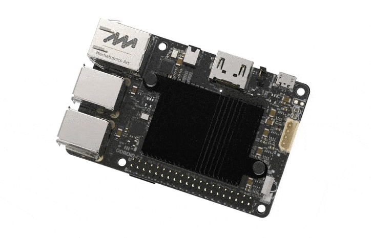
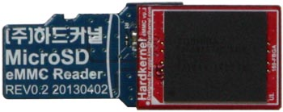

# WebKiosk

!

This is the code repo for a Web Kiosk Instructable at:
https://www.instructables.com/id/Web-Kiosk/

It is based on the ODROID C2 device:

!

The image that comes on the eMMC card from HardKernel is totally bloated for use as a kiosk, so for this build we'll be using meveric's Debian Stretch image; details about the image can be found [here](https://forum.odroid.com/viewtopic.php?f=138&t=27449).

Download the ~93MB C2.img.xz image file:

* https://oph.mdrjr.net/meveric/images/Stretch/
* http://fuzon.co.uk/meveric/images/Stretch/ [MIRROR]

## Writing the image
!

Now, download a tool called [Etcher](https://etcher.io/) which will allow you to write the image file you downloaded above to the eMMC card.

To do this, use the eMMC2SD card adapter, and insert into a microSD card reader on the computer you'll be running Etcher on.

When you run Etcher you first select the image you downloaded, and then select the microSD card reader, then hit Flash. 

**NOTE**
_When selecting a drive in step 2, make sure it is your microSD card reader, because if you select another driver, Etcher will overwrite that drive, and the data can't be recovered! **I won't be responsible for lost data, so read the instructions on the Etcher download page**._

**NOTE2**
_On windows, when you insert the eMMC2SD card adapter, you may get popups about the need to format the drive. IGNORE these dialogs. Just hit cancel, and close any FileManager windows. The same will happen when Etcher starts, and when it finishes. Just close any Windows dialogs that popup._


Once Etcher is complete, you can remove the eMMC2SD card adapter, remove the eMMC card, and insert the card onto the bottom of your ODROID.

For this next step you will need to plug-in a regular HDMI monitor NOT the touchscreen monitor. You'll also need to plugin a keyboard into the ODROID for this first step. The default OS is configured for a 1920x1080px60hz screen, so plugging in the touchscreen will make any text unreadable.

Make sure you have an ethernet cable attached to your ODROID
Power up the machine; you'll see a series of startup output. The screen will blank, which is normal as it expands the image onto the full space of the eMMC drive, and the screen will then refill with the startup output, and then blank to the login screen.

## Configure the kiosk

### Login: root/odroid

```bash
apt-get update && apt-get dist-upgrade -y
```

```bash
ifconfig
```
(write down IP address and mac-address for SSH login)

```bash
reboot
```

### Login: root/odroid

```bash
wget -O setup.sh https://raw.githubusercontent.com/ZacWolf/WebKiosk/master/setup.sh
chmod 700 setup.sh && ./setup.sh
```

Disconnect power

Connect touch screen display

Connect power

### SSH login: root/{newpasword}

```bash
setupkiosk.sh
```


#### Optional: but your kiosk user won't need root privs...

```bash
apt-get install sudo -y
echo 'user ALL=(ALL:ALL) ALL' >> /etc/sudoers`