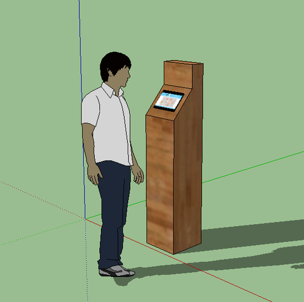

# WebKiosk
## WebKiosk using ODROID C2
!

login: root/odroid

`apt-get update && apt-get dist-upgrade -y`

`ifconfig`
	(write down IP address and mac-address for SSH login)

`reboot`

### SSH login: root/odroid
`passwd`

`echo "set paste\nset mouse=r" > .vimrc`

Reset all the defaults
`sed -i 's/^setenv\ m\ /#\ setenv\ m\ /g' /boot/boot.ini
sed -i "s/^setenv\ m_bpp\ /#\ setenv\ m_bpp\ /g" /boot/boot.ini
sed -i 's/^setenv\ vout\ /#\ setenv\ vout\ /g' /boot/boot.ini`

Set the new settings
`sed -i 's/^#\ setenv\ vout\ \"dvi\"/setenv\ vout\ \"dvi\"/g' /boot/boot.ini
sed -i "s/setenv\ monitor_onoff\ \"false\"/setenv\ monitor_onoff\ \"true\"/" /boot/boot.ini
sed -i "s/#\ setenv\ m_bpp\ \"24\"/setenv\ m_bpp\ \"24\"/" /boot/boot.ini`

VU5/7
sed -i 's/^#\ setenv\ m\ \"800x480p60hz\"/setenv\ m\ \"1024x600p60hz\"/g' /boot/boot.ini`

VU7+
`sed -i 's/^#\ setenv\ m\ \"1024x600p60hz\"/setenv\ m\ \"1024x600p60hz\"/g' /boot/boot.ini`

VU8
`sed -i 's/^#\ setenv\ m\ \"1024x768p60hz\"/setenv\ m\ \"1024x768p60hz\"/g' /boot/boot.ini`

Regular monitor
`sed -i 's/^#setenv\ m\ \"1920x1080p60hz\"/setenv\ m\ \"1920x1080p60hz\"/g' /boot/boot.ini`

 
`apt-get install net-tools dbus d-feet less curl bzip2 lsb-compat lsb-release fortune fortunes -y`

`wget -O .bashrc https://raw.githubusercontent.com/ZacWolf/WebKiosk/master/.bashrc`

`shutdown -h now`

Disconnect power

Connect touch screen display

Connect power

###SSH login: root/{newpasword}

`wget -O setupkiosk.sh https://raw.githubusercontent.com/ZacWolf/WebKiosk/master/setupkiosk.sh`

`chmod 700 setup.sh
setup.sh`

#### Optional:

`apt-get install sudo -y
echo 'user ALL=(ALL:ALL) ALL' >> /etc/sudoers`